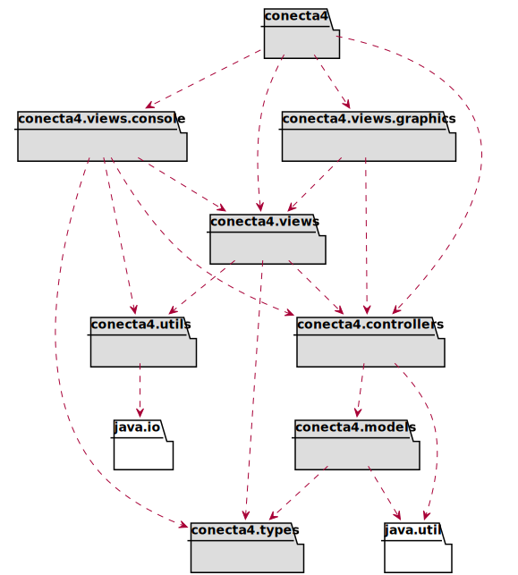
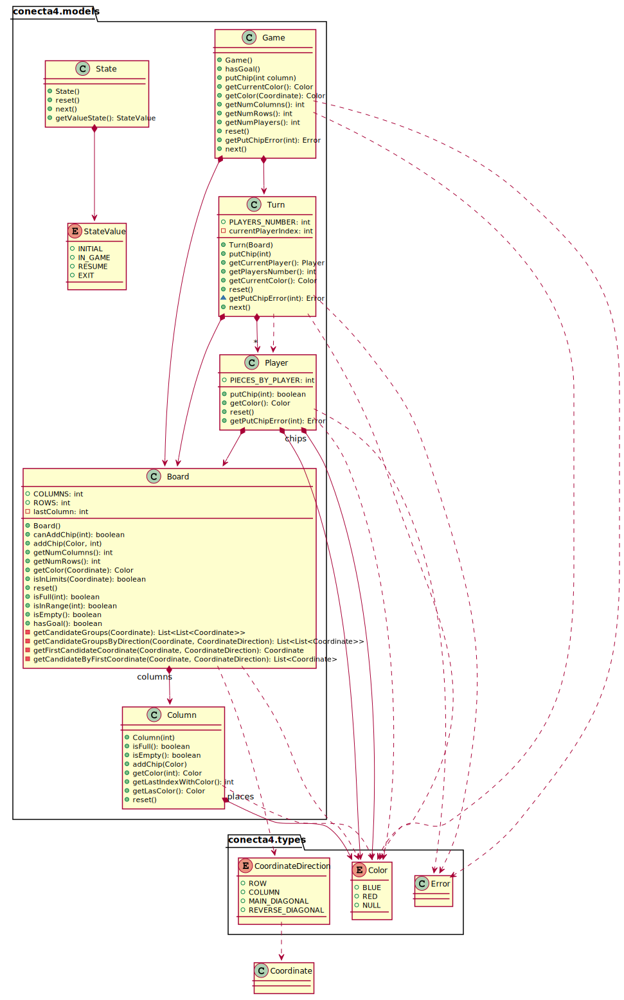

# Conecta4 with Double Dispatching
David Vázquez Martínez  
[davidvazquezmar@gmail.com](mailto:davidvazquezmar@gmail.com)

## Autoevaluación

**8**

* PROS:
  * Se han aplicado las técnicas y principios vistos en la asignatura.
  * Se han generado diagramas UML del modelo y arquitectura.
  * Se han separado correctamente las responsabilidades de los paquetes. Con módulos maven incluso. 
  * El juego funciona.
* CONS:
  * Faltan diagramas UML por crear.
  * La lógica de cálculo de ganador está mal situada. Se deben crear la estructura de *Goal* que realize este trabajo.
  * Aunque las técnicas se han asimilado (en una fase teórica inicial), sin la ayuda de TicTacToe no habría sido posible.

### Arquitectura

### Models

